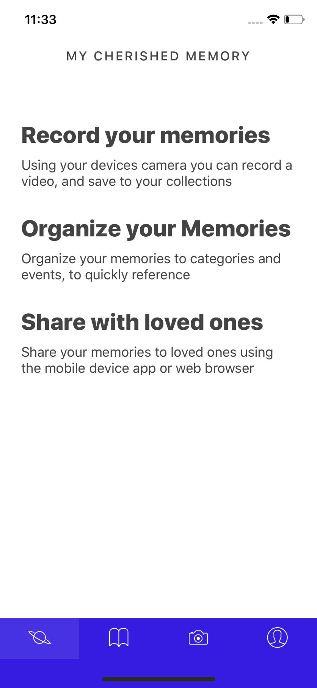
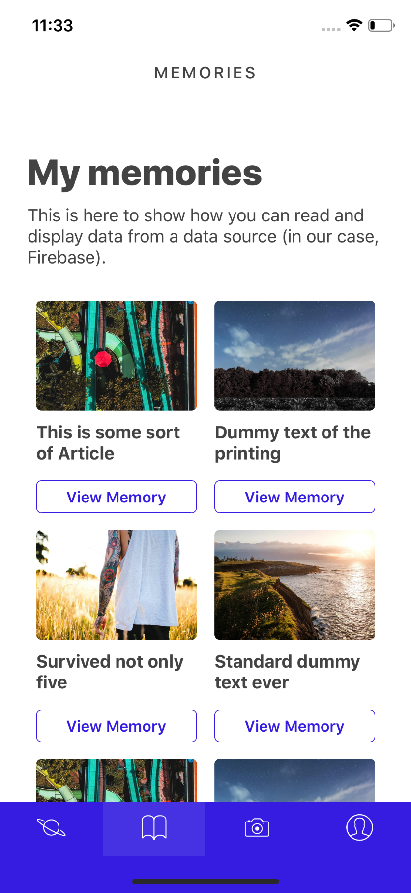
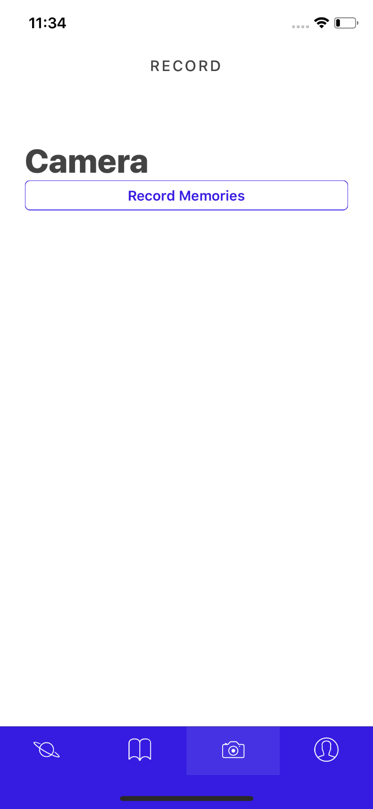
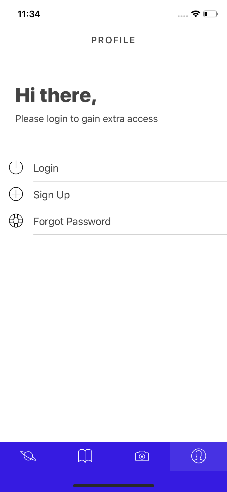

# LiveWell 2018 Student App Challenge

#### LiveWell RERC is sponsoring an app development competition for middle, high school, and college students as well as non-professional developers. Three winning apps will be selected to receive a cash award. We will also select two apps at random for prizes, so we encourage you to submit your project even if it is a simple app.
[Website](https://mycherishedmemory.com/)
### Running on IOS

### View Video Recordings

### Record using your phones camera

### Available Login

